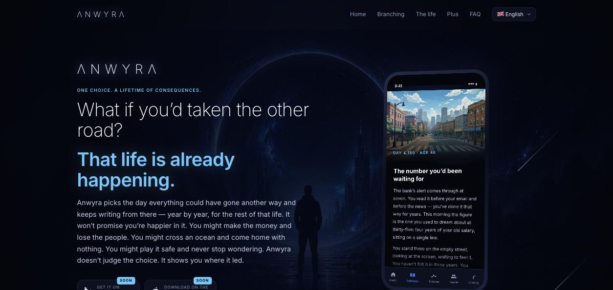
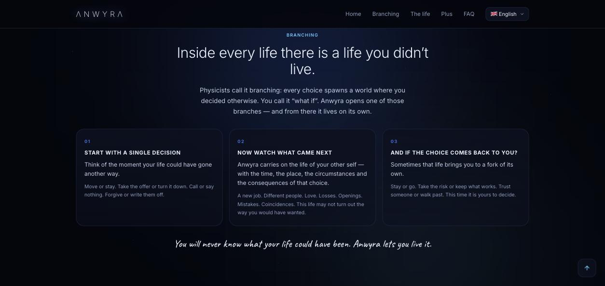
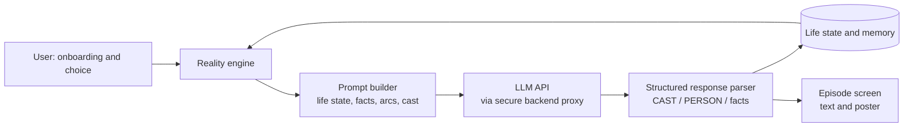
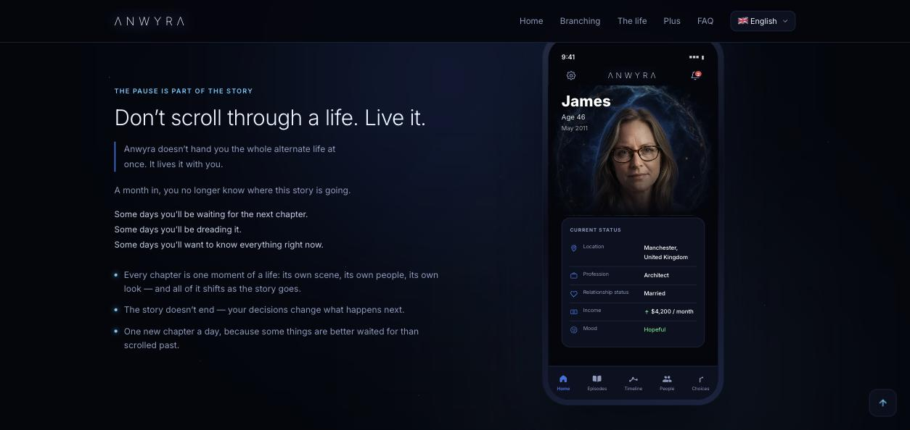
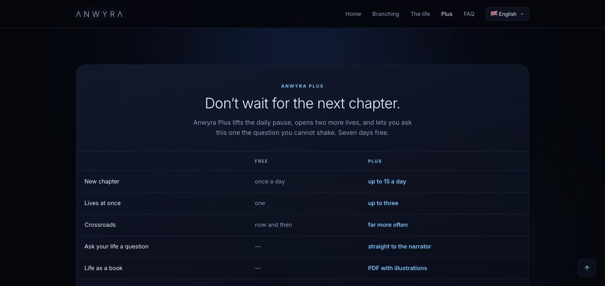

# ΛNWYRΛ

### An AI-powered alternative-life simulator

*One choice. A lifetime of consequences.*

[**anwyra.com**](https://anwyra.com) · Flutter · LLM · Firebase · Cloudflare

---

## What is Anwyra?

Anwyra is a mobile app that takes the moment your life could have gone another way and keeps
writing that other life — day by day, year by year. Careers, relationships, moves, losses and
historical context are generated by large language models as a continuous, personalized story.

It is not a random text generator: a custom **narrative engine** keeps the world consistent —
the same people, places, facts and consequences carry over from one episode to the next.

> This repository is a **project showcase**. The application source code is kept private
> (pre-release product). Happy to walk through the code and architecture in an interview.

## Key features

- **Branching lives** — start from a single decision and follow where it leads.
- **Episodic storytelling** — the alternate life unfolds in episodes instead of one wall of text.
- **Persistent memory** — life facts, relationships and pending life transitions are stored and
  fed back to the model, so the story stays coherent over years of in-app time.
- **Living characters** — AI-cast secondary characters with roles, relationships, regions and
  culturally authentic, AI-generated names.
- **Factual grounding** — prompts are designed to avoid invented cities, metro lines or landmarks.
- **Illustrated episodes** — a library of 717 poster prompts across 17 life spheres, with a
  116-rule mapping table that picks the right illustration for each scene.
- **13 languages** — fully localized interface.
- **Plus subscription & gifts** — monetization model designed from the start.

## How it works

1. **Reality engine** decides what happens next: story arcs, life events, transitions.
2. **Prompt builder** assembles the current life state, remembered facts, previous episodes and
   active characters into a compact context.
3. **LLM** writes the episode in a structured format.
4. **Parser** extracts characters (`Name=role=gender=region`), names and life facts from the
   response and writes them back into the app state.
5. The **episode screen** shows the story with a matching illustration.

## Engineering highlights

| Area | What was done |
|---|---|
| AI-assisted development | Built end to end with **Claude Code** as a development partner: architecture, features, debugging, refactoring |
| Prompt engineering | Context design for long-running stories, factual-accuracy rules, structured output formats |
| Data from AI output | Custom parsing of LLM responses into typed app state (characters, names, locations, facts) |
| Security | Identified the risk of an API key inside the client build; moving model calls behind a **Firebase Cloud Functions** proxy |
| Cost optimization | Unit economics per episode; cost-efficient model selection; illustrations pre-generated and served statically, so they add no per-request cost |
| Localization | 13 languages, locale-aware date formatting |
| Delivery | iOS release builds via Xcode on a real device; Google Play publishing in preparation; landing site on Cloudflare |

## Tech stack

- **App:** Flutter, Dart
- **AI:** LLM APIs, prompt engineering, structured outputs
- **Backend:** Firebase (Cloud Functions, data persistence)
- **Web:** anwyra.com, hosted on Cloudflare
- **Tools:** Claude Code, Git / GitHub, Xcode, Google Play Console

## Status

Pre-release. Core mechanics are being tested on device; store launch (Google Play, App Store)
is being prepared.

## Author

**Artem Zagrebelnyi** — founder and sole developer
📧 artemkmw@gmail.com · 🌐 [anwyra.com](https://anwyra.com)
